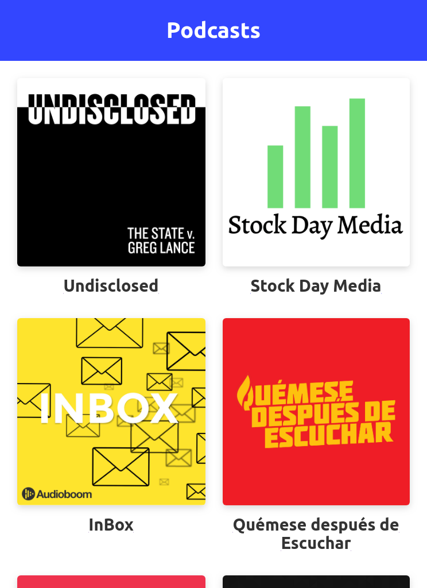

# App de podcast

App de podcast integradacon la api de AudioBoom
para aprender Next.js en el curso de platzi

[Link de la app](https://podcasts.azuref17.now.sh/)

## Como funciona?

Requiere Node.js 12

* `npm install` para instalar las dependencias.
* `npm run dev` para el entorno de desarrollo.
* `npm run build && npm start` para el entorno de produccion.

## Licencia

MIT